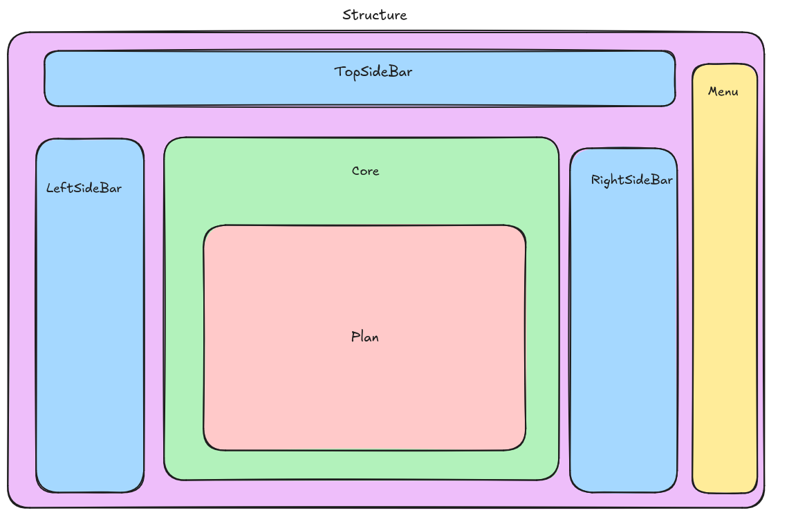

# Hubima

Hubima is a [Next.js](https://nextjs.org/) project.

## Instructions

##### Clone the project

Clone the repository on your local machine

```bash
$ git clone git@github.com:pgrandne/hubima.git
```

### Front End

We use NextJS 14.
If you want to launch the Front End locally:

1. Install the dependencies

```bash
$ npm install
```

2. Launch the server locally

```bash
$ npm run dev
```

Open [http://localhost:3000](http://localhost:3000) with your browser to see the result.

### Structure

```bash
├── app
│ ├── global.css
│ ├── layout.tsx
│ ├── page.tsx
├── components
│ ├── Structure
│ ├── ui
│ ├── theme-provider.tsx
│ ├── toogle.tsx
│ ├── WebSocket.tsx
├── data
├── lib
│ ├── type.ts
│ ├── utils.ts
```

### Plan

The displayed components on the page are in components/Structure folder following this plan : 

### Shadcn

We use [shadcn](https://ui.shadcn.com/) as components library. All components are in components/ui folder

### Data

Necessary data for the table are in /data folder

## Learn More

To learn more about Next.js, take a look at the following resources:

- [Next.js Documentation](https://nextjs.org/docs) - learn about Next.js features and API.
- [Learn Next.js](https://nextjs.org/learn) - an interactive Next.js tutorial.

You can check out [the Next.js GitHub repository](https://github.com/vercel/next.js/) - your feedback and contributions are welcome!
